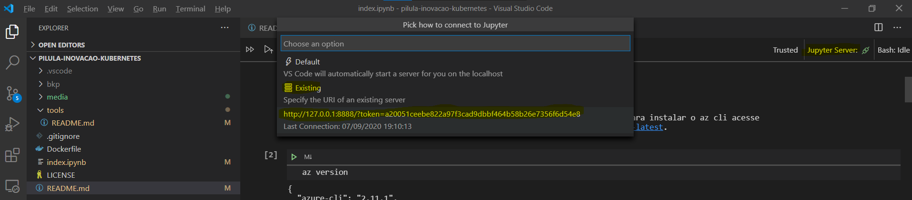
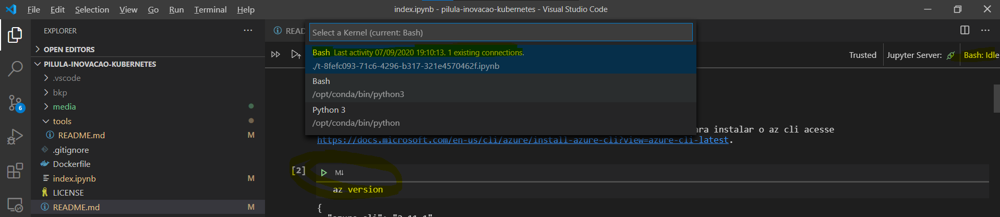

# Workshop interativo

Conheça os principais recursos do Kubernetes de forma interativa aprendendo enquanto faz.

Classic
[](http://binder.kdop.net/v2/gh/kdop-dev/pilula-inovacao-kubernetes.git/master?filepath=index.ipynb)

Lab
[](http://binder.kdop.net/v2/gh/kdop-dev/pilula-inovacao-kubernetes.git/master?urlpath=lab)

Após lançar o seu notebook, guarde a URL (copie ou adicione a barra de favotiros), isso permitirá retomar a mesma sessão do seu notebook que está sendo executada no servidor. Se você não usar a mesma URL, uma sessão limpa será criada, sem as suas modificações.

> Após uma hora, todos os dados serão apagados. Ao finalizar, faça download od seu notebook.

## Build local

```bash
export DOCKER_IMAGE=kdop/learn-kdop
export DOCKER_TAG=local

docker build -t $DOCKER_IMAGE:$DOCKER_TAG .

# Notebook
docker run -p 8888:8888 --rm --name kdop -v $PWD:/home/jovyan $DOCKER_IMAGE:$DOCKER_TAG

# Lab
docker run -p 8888:8888 -e JUPYTER_ENABLE_LAB=yes --rm --name kdop  $DOCKER_IMAGE:$DOCKER_TAG

# Com seu diretório local como volume (persistente, alterar os arquivos no seu dir, mas necessário clonar o repo antes)
docker run -p 8888:8888 -e JUPYTER_ENABLE_LAB=yes -v $PWD:/home/jovyan --rm --name kdop  $DOCKER_IMAGE:$DOCKER_TAG
```

> Para mais opções sobre volumes: [Use bind mounts](https://docs.docker.com/storage/bind-mounts/)

## Executando localmente a imagem do Binder

O Binder irá gerar e subir para o Docker Hub a imagem associada ao repositório do github, mas você pode executá-la localmente, precisando apenas conhecer o nome e a tag. Para uma lista completa de tags acesse: <https://hub.docker.com/repository/docker/kdop/learn-kdop-2ddev-2dpilula-2dinovacao-2dkubernetes-731f2f/tags?page=1>

```bash
export DOCKER_IMAGE=learn-kdop-2ddev-2dpilula-2dinovacao-2dkubernetes-731f2f
export DOCKER_TAG=3ba97a20d8e203c42219f6160f8799582df557a6

docker pull kdop/learn-kdop-2ddev-2dpilula-2dinovacao-2dkubernetes-731f2f:$DOCKER_TAG

# Jupyter Notebook
docker run -p 8888:8888 --rm --name kdop -v $PWD:/home/jovyan $DOCKER_IMAGE:$DOCKER_TAG

# Jupyter Lab
docker run -p 8888:8888 --rm --name kdop -e JUPYTER_ENABLE_LAB=yes -v $PWD:/home/jovyan kdop/$DOCKER_IMAGE:$DOCKER_TAG

# Output
...
To access the notebook, open this file in a browser:
        file:///home/jovyan/.local/share/jupyter/runtime/nbserver-7-open.html
    Or copy and paste one of these URLs:
        http://e5b8b0c4b501:8888/?token=77a79493c207052bc9c43e681db0d9fed586a9db096f41b7
     or http://127.0.0.1:8888/?token=77a79493c207052bc9c43e681db0d9fed586a9db096f41b7
```

> Não use o terminal do VS Code, ele irá reiniciar o vs code para alterar as configurações de servidor, ou execute o docker em segundo plano `docker run -d ...`

### Conectando o VS Code com seu servidor

Quando você executa o jupyter-notebook ele exibe uma URL como esta: <http://127.0.0.1:8888/?token=a20051ceebe822a97f3cad9dbbf464b58b26e7356f6d54e8>. Copie esta URL para utilizar no VS Code.

Selecione o notebook (extensão ipynb) que deseja conectar. O VS Code automaticamente iniciará um servidor no plano de fundo e renderizará o notebook.

Troque o servidor, como exibido na figura abaixo.



Por padrão, o kernel selecionado será o Python, troque selecionando a opção kernel, como na figura abaixo.



## Conectando no Azure Kubernetes Service

```bash
az login

az account set --subscription SharedKernel

# Verificar o estado do cluster
az aks show --name plataforma-pos --resource-group plataforma-pos | jq .powerState

# Iniciar o cluster
az aks start --name plataforma-pos --resource-group plataforma-pos

# Obter as credenciais
az aks get-credentials --resource-group plataforma-pos --name plataforma-pos -f work/kubeconfig
```

## Referênciass

* [How to reduce mybinder.org repository startup time](https://discourse.jupyter.org/t/how-to-reduce-mybinder-org-repository-startup-time/4956)
* [Binder - How to guides](https://mybinder.readthedocs.io/en/latest/howto/index.html)
* [Zero to BinderHub](https://binderhub.readthedocs.io/en/latest/zero-to-binderhub/setup-binderhub.html)
* [https://github.com/takluyver/bash_kernel](https://github.com/takluyver/bash_kernel)
* [Jupyter kernels](https://github.com/jupyter/jupyter/wiki/Jupyter-kernels)
* [https://pypi.org/project/ipykernel/](https://pypi.org/project/ipykernel/)
* [takluyver/bash_kernel](https://github.com/takluyver/bash_kernel)

## Treinamentos

* [free-programming-books](https://github.com/EbookFoundation/free-programming-books/blob/master/free-programming-books.md)
* [Katacoda](https://www.katacoda.com/)
* [Kubernetes Training and Certification](https://kubernetes.io/training/)
* [Learn Kubernetes Basics](https://kubernetes.io/docs/tutorials/kubernetes-basics/)
* [Introduction to Kubernetes](https://www.edx.org/course/introduction-to-kubernetes)
* [Linux Fundation - Kubernetes](https://training.linuxfoundation.org/training/course-catalog/?_sft_technology=kubernetes)
