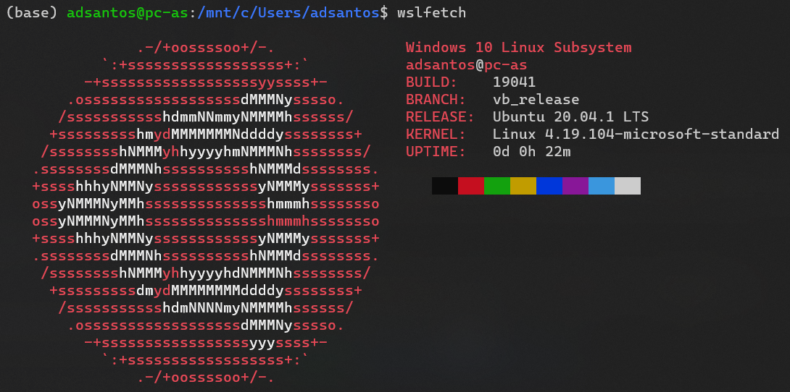
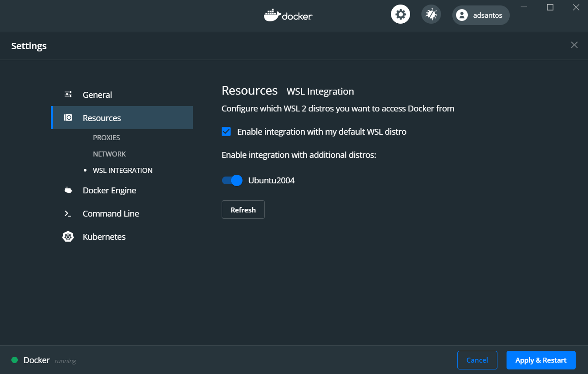
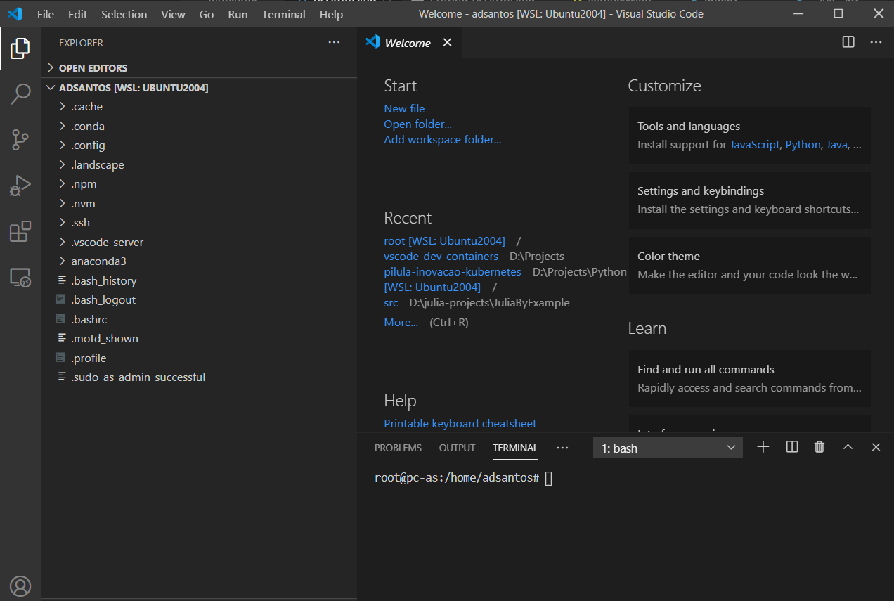
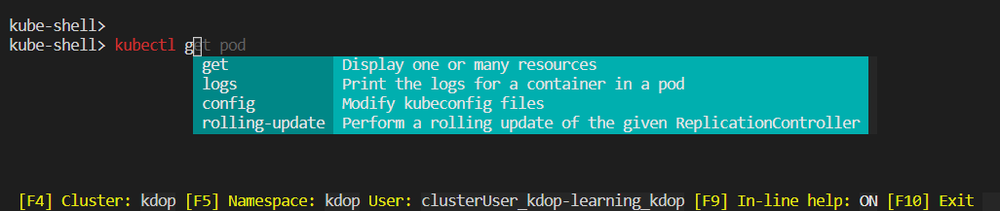

# Ferramentas

## Windows Subsystem for Linux 2

Fonte: [Windows Subsystem for Linux Installation Guide for Windows 10](https://docs.microsoft.com/en-us/windows/wsl/install-win10#:~:text=Check%20your%20Windows%20version%20by,build%20is%20lower%20than%2018361.) e [Updating the WSL 2 Linux kernel](https://docs.microsoft.com/en-us/windows/wsl/wsl2-kernel)

Verifique se a extensão WSL está instalada (Windows 10 Professional), abra um terminal e digite `wsl --help`.

Abra o documento [Windows Subsystem for Linux Installation Guide for Windows 10](https://docs.microsoft.com/en-us/windows/wsl/install-win10#:~:text=Check%20your%20Windows%20version%20by,build%20is%20lower%20than%2018361.) e execute as sessões:

* Install the Windows Subsystem for Linux - Pré-requisito
* Update to WSL 2 - Necessário para o Docker
* Install your Linux distribution of choice - Selecione Ubuntu 20.04 LTS
* Set up a new distribution - selecione um nome de usuário, a primeira parte do seu e-mail estará ok
* Set your distribution version to WSL 1 or WSL 2 - Selecione 2

### wsl utils

[A collection of utilities for WSL](https://github.com/wslutilities/wslu)

comando: `wslfetch`



comando: `wslview https://github.com/wslutilities/wslu/wiki/wslview`

Abre a URL no navegador padrão.

Ver também [Running WSL GUI Apps on Windows 10](https://techcommunity.microsoft.com/t5/windows-dev-appconsult/running-wsl-gui-apps-on-windows-10/ba-p/1493242)

## Docker Desktop

Fonte: [Install Docker Desktop on Windows](https://docs.docker.com/docker-for-windows/install/)

Instale o Doker Desktop ou verifique se está atualizado.

Se você já usa o wsl e tem algum linux instalado, provavelmente terá que convertê-lo para versão dois, verifique com o comando `wsl -l -v` na linha de comando (cmd), se a versão exibida for 1, siga o documento [Docker Desktop WSL 2 backend](https://docs.docker.com/docker-for-windows/wsl/).

Verifique a integração do Docker com wsl para o seu linux, acesse Docker Desktop e configurações. Somente a versão dois será exibida na lista, selecione as que deseja habilitar.

[Opcional] Entre no docker hub, se você não tem usuário crie um. Ter usuário no Docker Hub permitirá que você compartilhe imagens criadas por você (`docker push`).



### Kubernetes

Você pode usar o kubernetes que vem com o Docker Desktop. Habilite-o em Configurações | Kubernetes.

> Recomendado apenas se sua máquina for um pelo menos um Intel i5 com 8GB de RAM. Para desabilitar o kubernetes desmarque Habilitar Kubernetes nas configurações.

Para usar no Linux (wsl), copie o arquivo de configuração que está em ´/mnt/c/Users/seu-usuario/.kube/config` para onde desejar e configure a variável de ambiente `KUBECONFIG` para este arquivo.

Exemplo:

```bash
# seu-usuario = adsantos
cp /mnt/c/Users/adsantos/.kube/config /mnt/d/Projects/Python/pilula-inovacao-kubernetes/
# Configurando a variável
export KUBECONFIG=/mnt/d/Projects/Python/pilula-inovacao-kubernetes/config
# Testando
kubectl get nodes
NAME             STATUS   ROLES    AGE     VERSION
docker-desktop   Ready    master   9m20s   v1.16.6-beta.0
```

Alguns _hacks_ que irão economizar tempo:

```bash
nano ~/.bashrc

# no editor, no final do arquivo adicione

alias k='kubectl'
alias kg='kubectl get'
alias kl='kubectl logs -f'

kns() {
    kubectl config set-context --current --namespace="$1"
}

# ctrl +x, Y e [enter] para sair salvando do editor

source ~/.bashrc
```

Na linha de comando:

```bash
kns kdop
Context "kdop" modified.

kg pods
NAME                                                         READY   STATUS    RESTARTS   AGE
binder-7c477f4dc6-b2p2f                                      1/1     Running   0          76m
hub-5d9bdccf78-dhzb9                                         1/1     Running   0          76m
jupyter-kdop-2ddev-2dpilula-2dacao-2dkubernetes-2d5v7ifsja   1/1     Running   0          46m
kdop-dind-rbgct                                              1/1     Running   0          77m
kdop-dind-w95qk                                              1/1     Running   0          77m
kdop-image-cleaner-pkzpb                                     2/2     Running   0          77m
kdop-image-cleaner-vxdrr                                     2/2     Running   0          77m
proxy-6496df9b98-xcwgq                                       1/1     Running   0          76m
user-scheduler-8497d757d5-gxfvs                              1/1     Running   0          76m
user-scheduler-8497d757d5-jrrxj                              1/1     Running   0          76m

kl pod/binder-7c477f4dc6-b2p2f
```

## VS Code

Fonte: [Download Visual Studio Code](https://code.visualstudio.com/download)

Instale o VS Code ou verifique se há atualizações.

### Extensão Remote Development by Microsoft

Fonte: [Remote Development](https://marketplace.visualstudio.com/items?itemName=ms-vscode-remote.vscode-remote-extensionpack)

No menu lateral, selecione extensões (`ctrl+shift+X`) e procure pela extensão `Remote Development` e instale-a.

Teste o plugin, selecione comando (`ctrl + shift + P`) e digite `Remote: Show Remote Menu` e selecione `Remote: New Window using Distro ...` e selecione Ubuntu.

Na nova janela, selecione `Open Folder`.

O VS Code executará Você poderá selecionar diretórios da sua distro linux.



> Para trocar de usuário entre com o comand `su seu-usuario`.

### Terminal WSL

Você pode abrir um terminal para a sua distribuição linux no VS Code, a forma mais simples é configurá-lo para executar o wsl.

Abra Preferências | Configurações ou `ctrl + ,`. Procure por `terminal.integrated.shell.windows` e selecione editar.

Procure as linhas abaixo ou adicione-as. Troque o `user` pelo seu usuário.

```bash
    "terminal.integrated.shell.windows": "C:\\WINDOWS\\System32\\wsl.exe",
    "terminal.integrated.shellArgs.windows": ["-u", "adsantos"],
```

## Instalando o Helm

Fonte: [Installing Helm](https://helm.sh/docs/intro/install/)

[Helm](https://helm.sh/) é uma das maneiras para colocar seu software rodando no kubernetes, a maioria das empresas considera essa a melhor opção.

Você poderá instalar o helm para usar no CMD e Powershell e/ou Linux (wsl), basta seguir todos os passos.

### CMD e Powershell

Como administrador: 

```powershell
choco install kubernetes-helm

helm version
version.BuildInfo{Version:"v3.3.0", GitCommit:"8a4aeec08d67a7b84472007529e8097ec3742105", GitTreeState:"dirty", GoVersion:"go1.14.7"}
```

### Linux (wsl)

```bash
curl -fsSL -o get_helm.sh https://raw.githubusercontent.com/helm/helm/master/scripts/get-helm-3

sudo chmod 700 get_helm.sh

./get_helm.sh

helm version
version.BuildInfo{Version:"v3.3.0", GitCommit:"8a4aeec08d67a7b84472007529e8097ec3742105", GitTreeState:"dirty", GoVersion:"go1.14.7"}
```

## kubectl

Quando você instala o Docker Desktop ele disponibiliza a ferramenta `kubectl`, porém somente enquanto está em execução. Você pode desejar controlar a versão e os plugins instalados para o seu `kubectl`, então instale uma versão independente, seguindo as instruções em: <https://kubernetes.io/docs/tasks/tools/install-kubectl/> 

## krew

É um gerenciador de plugins para o `kubectl`. Instale seguindo as instruções para Linux em: <https://krew.sigs.k8s.io/docs/user-guide/setup/install/#bash>

Se o ingress do seu cluster for um Nginx, sugiro instar o [ingress-nginx](https://kubernetes.github.io/ingress-nginx/kubectl-plugin/), ele ajudará a avaliar configurações e eventuais problemas com suas configurações de ingress.

## Quase pronto

Você tem um ambiente para desenvolvimento e execução de containers, porém, o Docker Desktop e o WSL ainda precisam de alguns ajustes.

### Executar docker com sudo

Abra um terminal wsl (exemplo: ubuntu) e excute:

`docker ps`

Provavelmente retornará um erro de permissão. Para resolver isso:

`sudo usermod -aG docker ${USER}`

Sai do terminal e entre novamente, você será capaz de executar o comando sem `sudo`.

## Outras ferramentas

Há muitas ferramentas criadas para auxiliar na operação e desenvolvimento de kubernetes e docker e com o uso você irá selecionar as melhores para o seu uso, um destque é o [kube-shell](https://github.com/cloudnativelabs/kube-shell). Ele fornece um auxílio para completar os comando, ajuda com o significado de cada comando e valores do ambiente, como nome do cluster, namespace e usuário. Recomendado para quem está iniciando ou simplesmente gosta de um shell interativo.



Mensão honrosa para o [Visual Studio Code](https://code.visualstudio.com/) e os plugins: [Python](https://marketplace.visualstudio.com/items?itemName=ms-python.python), que permite executar e editar notebooks; [docker](https://marketplace.visualstudio.com/items?itemName=ms-azuretools.vscode-docker); [Remote - Containers](https://marketplace.visualstudio.com/items?itemName=ms-vscode-remote.remote-containers) e [Kubernetes](https://marketplace.visualstudio.com/items?itemName=ms-kubernetes-tools.vscode-kubernetes-tools).

[Anaconda](https://docs.conda.io/en/latest/miniconda.html), [Python](https://www.python.org/) e [jupyter-notebook](https://jupyter.org/), uma combinação muito útil para experimentos, automação de tarefas, treinamento e documentação de procedimentos.

## Palavras finais

Agora você tem um ambiente e alguns aceleradores para criar suas imagens docker, testá-las, compartilha-las* (`docker`), executar seu próprio cluster de kubernetes (Configurações | Kubernetes), administrá-lo (`kubectl`) e instalar suas aplicações (`helm`).

> * Para compartilhar uma imagem publicamente você precisará de um usuário no Docker Hub. Cuidado com informações sensíveis, tais como: tokens; senhas; endereços de rede, usuários, e-mails, tabelas, etc. Verifique seu código-fonte antes de submetê-lo à ambientes públicos.
